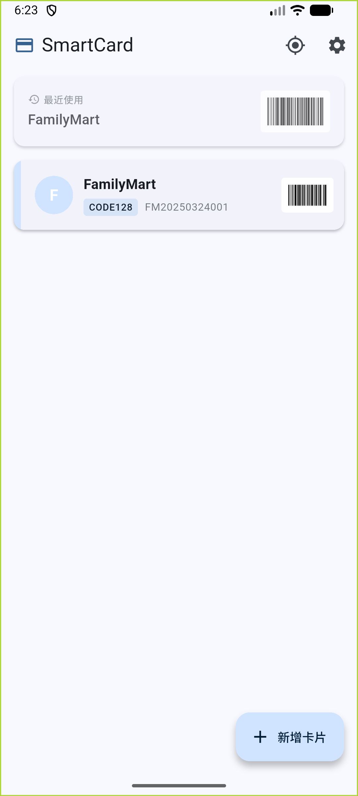
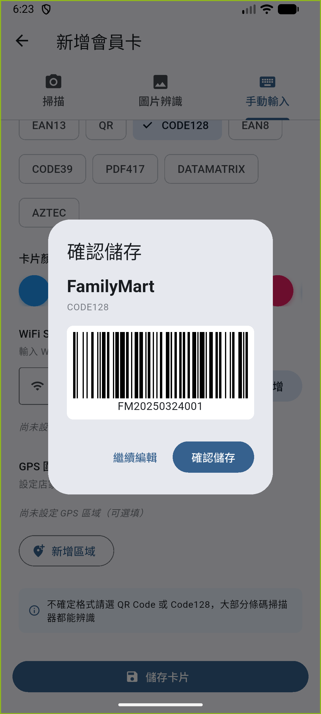

# SmartCard 智慧會員卡錢包

純本地、完全離線的 Android App。整合所有會員卡條碼，透過 GPS + WiFi SSID 自動偵測店家，桌面小工具自動顯示對應條碼。

## 特色

- **完全離線** — 不需網路、不需帳號、不需伺服器
- **自動偵測** — WiFi SSID + GPS 自動辨識當前店家
- **桌面小工具** — Android Widget 直接顯示常用條碼
- **加密儲存** — Hive 加密資料庫 + Android KeyStore
- **多種輸入** — 相機掃描 / 截圖辨識 / 手動輸入

## 截圖

| 主畫面 | 儲存確認 |
|--------|----------|
|  |  |

## 技術棧

| 項目 | 技術 |
|------|------|
| 框架 | Flutter 3.x |
| 本地 DB | Hive（加密） |
| 桌面小工具 | home_widget |
| 條碼顯示 | barcode_widget |
| 條碼掃描 | google_mlkit_barcode_scanning |
| GPS | geolocator |
| WiFi 偵測 | network_info_plus |
| 權限管理 | permission_handler |

## 專案結構

```
lib/
├── main.dart                 # App 入口
├── app_controller.dart       # 全域狀態管理（Singleton + ChangeNotifier）
├── app_router.dart           # 路由定義
├── models/
│   ├── member_card.dart      # 會員卡資料模型 + GpsZone
│   └── app_settings.dart     # App 設定模型
├── services/
│   ├── database_service.dart # Hive 加密資料庫
│   ├── barcode_service.dart  # 條碼掃描 / 辨識
│   ├── location_service.dart # WiFi + GPS 偵測引擎
│   ├── widget_service.dart   # Android Widget 通訊
│   └── backup_service.dart  # 加密備份匯出/匯入
├── screens/
│   ├── home_screen.dart      # 主畫面（卡片列表 + 偵測狀態）
│   ├── add_card_screen.dart  # 新增卡片（含店家自動補全）
│   ├── card_detail_screen.dart # 條碼全螢幕顯示
│   └── settings_screen.dart  # 設定頁面
└── widgets/
    ├── card_widget.dart           # 卡片列表項目
    ├── barcode_display_widget.dart # 條碼顯示元件
    ├── location_status_card.dart  # 偵測狀態卡片（含 shimmer）
    ├── store_color_picker.dart    # 自訂顏色選擇器
    ├── ssid_keyword_editor.dart   # WiFi 關鍵字編輯器
    └── gps_zone_editor.dart       # GPS 圍欄區域編輯器
```

## 開發

### 環境需求

- Flutter 3.4+
- Dart 3.4+
- Android SDK（API 34 建議）

### 建置

```bash
# 安裝依賴
flutter pub get

# 產生 Hive adapters
dart run build_runner build --delete-conflicting-outputs

# Debug build
flutter build apk --debug

# Release build
flutter build apk --release
```

### 執行

```bash
# 連接 Android 裝置或模擬器
flutter run
```

## 開發階段

- [x] **Phase 1** — 架構 + 核心邏輯（資料模型、DB、條碼、偵測、Widget 架構）
- [x] **Phase 2** — UI 設計（HomeScreen、CardDetailScreen、AddCardScreen、SettingsScreen）
- [x] **Phase 3** — 整合 + Debug
  - 相機即時掃描條碼（mobile_scanner）
  - 卡片編輯（店名、條碼、顏色、WiFi、GPS）
  - GPS 圍欄 UI（新增/編輯/刪除地理區域）
  - 桌面小工具資料流驗證（LocationService → WidgetService → Kotlin Provider）
  - 加密備份匯出/匯入（AES-256-CBC + PBKDF2，支援合併或取代）
  - E2E 測試擴充（8 個整合測試覆蓋主要使用流程）

## 權限說明

| 權限 | 用途 |
|------|------|
| `CAMERA` | 相機掃描條碼 |
| `ACCESS_FINE_LOCATION` | GPS 偵測店家位置 |
| `ACCESS_WIFI_STATE` | WiFi SSID 偵測店家 |
| `RECEIVE_BOOT_COMPLETED` | 開機自動更新 Widget |
| `FOREGROUND_SERVICE_LOCATION` | 背景位置偵測 |
| `POST_NOTIFICATIONS` | 偵測到店家時通知 |

## License

Private repository.
